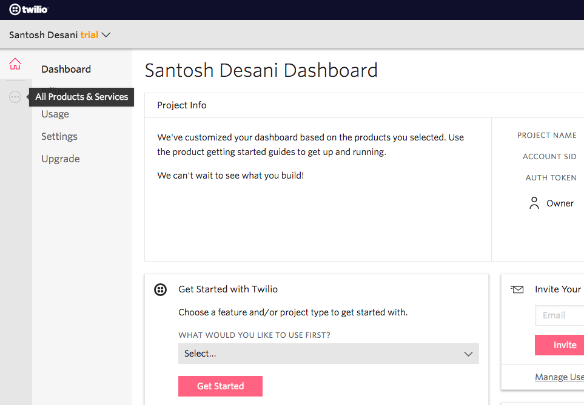
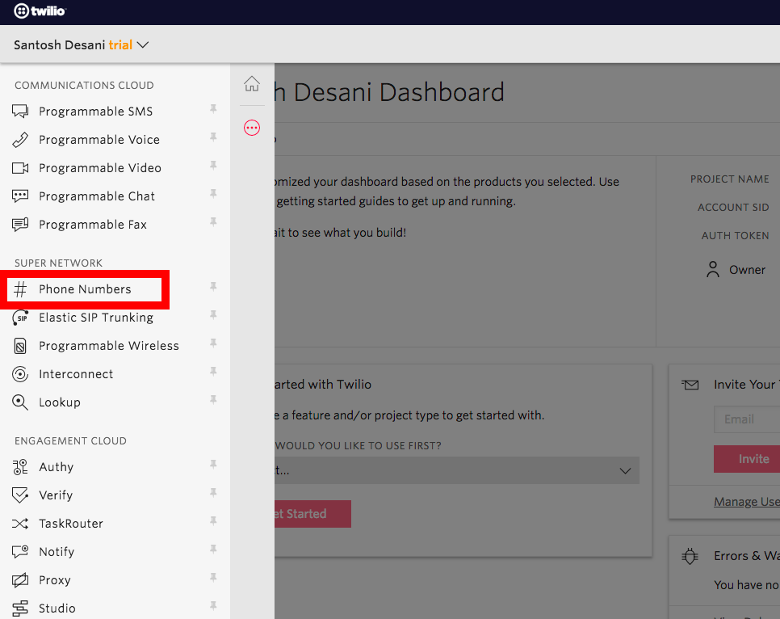
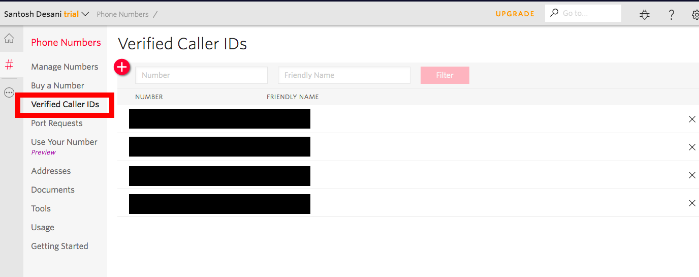
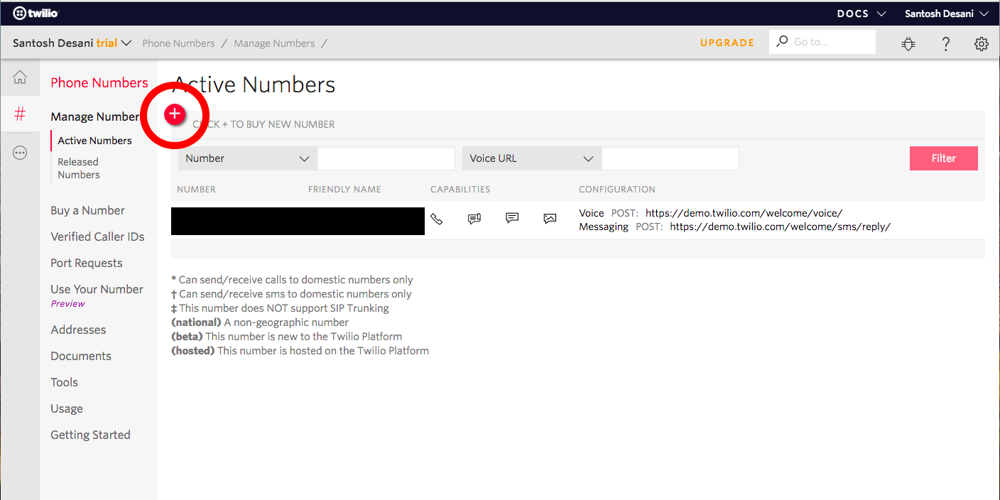
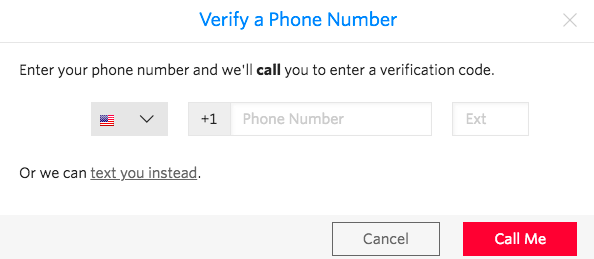
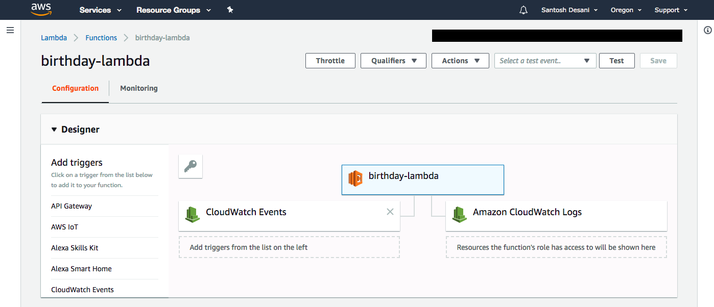
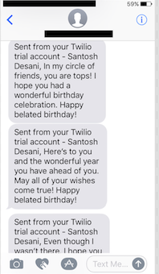

# schedule-text-lambda
Send text message to someone on a defined schedule using AWS Lambda &amp; CloudWatch

## Requirements

* AWS Account
* Twilio Account

## Setup AWS Lambda with Scheduled Events to send messages via Twilio

I implemented a simple lambda function which takes in input like **name** and **phone number** of the person we want to send the text message to. Below are the steps on how to create the Twilio Account, Lambda Function and CloudWatch Rule.

### Creating Twilio Account

* I was using a free trial account of Twilio, but you can even choose to use a regular account.
* In order to create the free trial account, follow the documentation on, [How to work with your free Twilio trial account](https://www.twilio.com/docs/usage/tutorials/how-to-use-your-free-trial-account).
* Once the account is created, log on to the [Console Dashboard](https://www.twilio.com/console), and grab the *Account SID* and *Auth Token* from there. We would need this while using the Twilio client, to send the messages, in our Lambda.
* At this point you should have a Twilio account created, and a phone number assigned to your account, which we can use to send the messages.
* If you are using free trial account, you also need to verify the recipients phone number. In order to do that,
	* Log onto the [Console Dashboard](https://www.twilio.com/console), on the left, click on **All products and services** icon.
	
	* You should see the option of **# Phone Numbers**, click on that.
	
	* Right on this window you should see the number allocated to your account.
	* Click on **Verified caller IDs** option on the right.
	
	* This screen will show you the phone numbers that are verified by your account (the number on which you can send the messages). If you haven't verified any number yet the list will be empty.
	* Next we need to verify our recipients number. Click on the **+** sign on the top left side which will ask you to enter a phone number.
	
	* You will be asked to choose if you want to receive a call on that number or a text. Twilio will send a verification code on that number. We would need that in order to successfully get it added to the verified  phone numbers list. Once added, it can now be used as recipient’s number.
	
* The above steps might not be required if you are using a regular account.

### Create Lambda function

* You can either follow the [lambda-tutorial](https://docs.aws.amazon.com/toolkit-for-eclipse/v1/user-guide/lambda-tutorial.html) provided by AWS to get started on creating your lambda. Once you have the **Hello World** created, you can refer to my [schedule-text-lambda project](https://github.com/sdesani/schedule-text-lambda) on GitHub.
* Alternatively you can also clone the project,
```
git clone https://github.com/sdesani/schedule-text-lambda.git
```
and follow the **Create an Amazon S3 Bucket for Your Lambda Code** and **Upload the Code** instructions in [lambda-tutorial](https://docs.aws.amazon.com/toolkit-for-eclipse/v1/user-guide/lambda-tutorial.html).
* If you are using schedule-text-lambda, make sure you fill-out the details like, Twilio SID and Auth Token.
* Once uploaded, you can sign in to your [AWS Lambda Dashboard](https://console.aws.amazon.com/lambda) and check to see if your lambda got deployed. You should see the name of the lambda function (if you deployed the one on the GitHub, the name would be '**schedule-text-lambda**').

### Configure a CloudWatch Rule

* Create a new rule, which will trigger our lambda function, every 45 mins (this is configurable).
* You can specify the value as a rate or in the cron expression format. All schedules use the UTC time zone, and the minimum precision for schedules is one minute.

* In the **Configure Input** section, select **Constant (JSON text)** and add the following json string,
```
{ "toNumber":"<recipients phone number>", "name":"<recipients name>" }
```
* If you notice, the json structure has to be similar to the [RequestDTO](https://github.com/sdesani/schedule-text-lambda/blob/schedule-text/src/main/java/com/amazonaws/lambda/schedule/text/lambda/RequestDTO.java)
* If you go back now to the **Lambda Function Console** and navigate to the **Trigger** tab, you should see the CloudWatch has been added:

* After 45 minutes, CloudWatch will trigger the Lambda Function and the message should get delivered to the recipient:


### Future Enhancements

* Planning to add reading of input from some datastore (DynamoDb or RDS)
* The CloudWatch Rule when triggers the lambda, it should read the person table and scan for the people who have b'day that day
* And then trigger the schedule-text-lambda function to send a b'day message to all those people.


